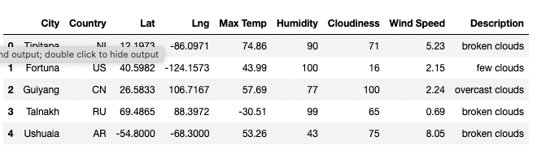
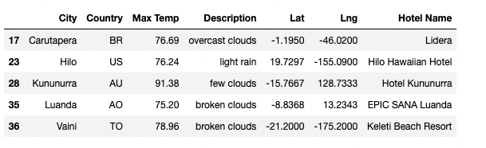

# World_Weather_Anlysis: Module 6 - Vacation Maps

## Overview of Deliverables 

### 1. Retrieve Weather Data 

### 2. Create Customer Travel Destinations Map

### 3. Create a Travel Itinerary Map

## Summary & Thoughts

