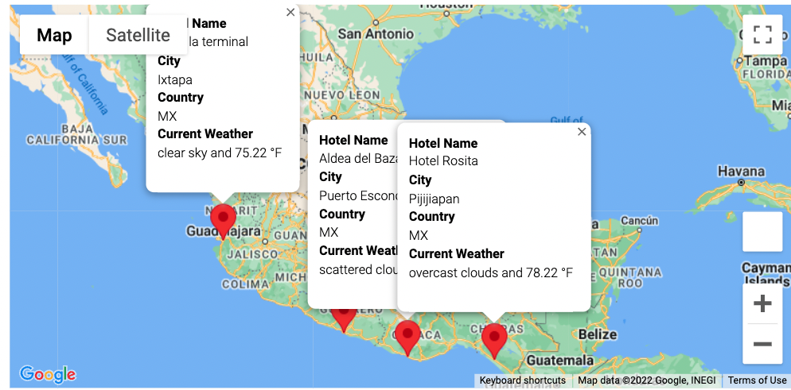

# World_Weather_Analysis: Module 6 - Vacation Maps

## Overview of Deliverables 

### 1. Retrieve Weather Data 

Deliverable 1 Dataframe.

### 2. Create Customer Travel Destinations Map

Deliverable 2 Dataframe. 

Deliverable 2 Map.

### 3. Create a Travel Itinerary Map

Deliverable 3, Travel Map.

Deliverable 2, Travel Marker Map.

## Summary and Thoughts

Being trained as an economist, I found the use of API's to be extremly exciting. The ability to use and access to this data, is valuble for almost all types of research. I plan to be utilizing my newly found API skills for future projects and career ambitions. 

I also noticed reviewing the Google API documentation that they have agricultural data. I plan to use this in my final project and was a great resource to discover. 

